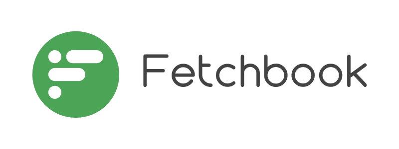

> [!WARNING]  
> This plugin is still under construction !!.

# Fetchbook: Easy Facebook Video Downloading

<br />
<p align="center">
    <a href="https://edukit" target="_blank"></a>
    <br />
    <br />
    <b>Fetchbook is a Flutter plugin designed to simplify Facebook video downloading within your Flutter applications. With Fetchbook, effortlessly integrate video downloading capabilities and enhance the user experience of your Flutter apps.</b>
    <br />
    <br />

[](https://pub.dev/packages/fetchbook) 
[](https://github.com/swiftsyncnp/fetchbook/blob/master/LICENSE) 
[](https://github.com/swiftsyncnp/fetchbook)


## Features

- **Effortless Video Downloading:** Fetchbook simplifies the process of downloading Facebook videos, allowing users to save their favorite videos for offline enjoyment.

- **Seamless Integration:** Integrate Fetchbook into your Flutter projects with ease. With simple and intuitive APIs, you can quickly add Facebook video downloading functionality.

- **Cross-Platform Compatibility:** Fetchbook supports both iOS and Android platforms, ensuring a consistent experience for users on different devices.

- **Configurable Options:** Customize the video downloading experience by configuring options such as video quality and download location, giving users control over their preferences.

- **Reliable and Efficient:** Built with Flutter best practices, Fetchbook offers a reliable and efficient solution for integrating Facebook video downloading, enhancing the performance of your apps.

## Getting Started

Follow these steps to get started with Fetchbook in your Flutter project:

1. **Installation:** Add Fetchbook to your `pubspec.yaml` file:

    ```yaml
    dependencies:
      fetchbook: ^1.0.0
    ```

2. **Import Fetchbook:** Import Fetchbook into your Dart code:

    ```dart
    import 'package:fetchbook/fetchbook.dart';
    ```

3. **Download Video:** Initiate video downloading with a simple API call:

    ```dart
    // Replace 'videoUrl' with the actual Facebook video URL
    await Fetchbook.downloadVideo(videoUrl);
    ```

4. **Customization:** Customize the download behavior and options according to your app's needs.

## Example Usage

```dart
import 'package:flutter/material.dart';
import 'package:fetchbook/fetchbook.dart';

void main() => runApp(MyApp());

class MyApp extends StatelessWidget {
  @override
  Widget build(BuildContext context) {
    return MaterialApp(
      title: 'Fetchbook Demo',
      home: MyHomePage(),
    );
  }
}

class MyHomePage extends StatelessWidget {
  final String videoUrl = '...'; // Facebook video URL

  Future<void> _downloadVideo() async {
    await Fetchbook.downloadVideo(videoUrl);
  }

  @override
  Widget build(BuildContext context) {
    return Scaffold(
      appBar: AppBar(
        title: Text('Fetchbook Demo'),
      ),
      body: Center(
        child: ElevatedButton(
          onPressed: _downloadVideo,
          child: Text('Download Facebook Video'),
        ),
      ),
    );
  }
}
```

## License

```
BSD 3-Clause License

Copyright (c) 2023, SwiftSync
All rights reserved.

Redistribution and use in source and binary forms, with or without
modification, are permitted provided that the following conditions are met:

1. Redistributions of source code must retain the above copyright notice,
   this list of conditions and the following disclaimer.

2. Redistributions in binary form must reproduce the above copyright notice,
   this list of conditions and the following disclaimer in the documentation
   and/or other materials provided with the distribution.

3. Neither the name of the copyright holder nor the names of its
   contributors may be used to endorse or promote products derived from
   this software without specific prior written permission.

THIS SOFTWARE IS PROVIDED BY THE COPYRIGHT HOLDERS AND CONTRIBUTORS "AS IS"
AND ANY EXPRESS OR IMPLIED WARRANTIES, INCLUDING, BUT NOT LIMITED TO, THE
IMPLIED WARRANTIES OF MERCHANTABILITY AND FITNESS FOR A PARTICULAR PURPOSE ARE
DISCLAIMED. IN NO EVENT SHALL THE COPYRIGHT HOLDER OR CONTRIBUTORS BE LIABLE
FOR ANY DIRECT, INDIRECT, INCIDENTAL, SPECIAL, EXEMPLARY, OR CONSEQUENTIAL
DAMAGES (INCLUDING, BUT NOT LIMITED TO, PROCUREMENT OF SUBSTITUTE GOODS OR
SERVICES; LOSS OF USE, DATA, OR PROFITS; OR BUSINESS INTERRUPTION) HOWEVER
CAUSED AND ON ANY THEORY OF LIABILITY, WHETHER IN CONTRACT, STRICT LIABILITY,
OR TORT (INCLUDING NEGLIGENCE OR OTHERWISE) ARISING IN ANY WAY OUT OF THE USE
OF THIS SOFTWARE, EVEN IF ADVISED OF THE POSSIBILITY OF SUCH DAMAGE.
```

## Contributing

We welcome contributions! If you have any ideas, bug reports, or feature requests, please open an issue or submit a pull request.

## Contact

For any inquiries or support, please contact us at swiftsync.tech@gmail.com.

© 2024, SwiftSync. All rights reserved.
